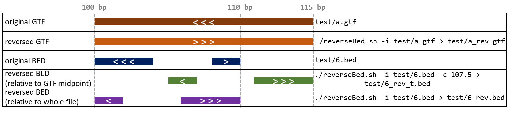

# reverseBed
Change relative strand orientation of a BED or GTF file. 

*Note: Current implementation works with tracks on a single chromosome.*

```bash
usage:
  reverseBed.sh [options]
    -i <bed/gtf> Input file.
    -c <center> Center to reverse the bed. Omit to use the midpoint of the input annotation.
```



---
# TODO
- Implement grouping by chromosome.
